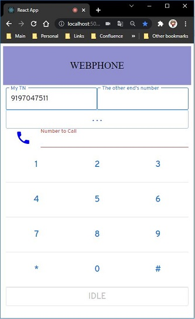

# webrtc-phone-advanced-react

A phone in your browser using Typescript and React

# What is this thing ?

This demonstration application is intended as a simple implementation of a "phone in a browser". The objective was a simple web application that is capable of basic telephone-like actions like placing and receiving calls, and sending DTMF digits. More complicated capabilities like managing multiple calls, placing calls on hold, and managing PC microphone and speaker configuration are not addressed. This app is limited to a single web-browser participant and a single voice network telephone involved in any call.



Digits for placing calls and sending DTMF tones can be entered via the keyboard in the "number to call" text field or via the telephone keypad on the screen. DTMF digits can be sent once the call is answered. They will be sent as sequence of tones after they have been entered.

# The Overall Solution

This app runs an HTTP server that pushes a basic React page, and then listens for requests from the browser to send or accept calls.

The app creates a connection topology that uses the Bandwidth WebRTC capabilities to control the Browser media streams, and the Bandwidth Programmable Voice BRIDGE capabilities to control calls to telephones.

The web page will register itself when it launches, and establish the initial configuration that is used for subsequent telephone calls to all of those telephones out there in the real world. This initial configuration consists of...

- a WebRTC Participant associated with the web page
- a WebRTC Session
- a SIP Interconnection WebRTC Participant that links the WebRTC Session to the SIP voice call
- a Programmable Voice call that allows Programmable Voice to manage and control the interconnection between WebRTC and the Programmable Voice world


The app establishes a WebRTC Session with two Participants on the WebRTC side of the configuration. One of the Participants is used to represent the Browser, and one of the Participants is used to represent the connection to the Programmable Voice infrastructure.

On the Programmable Voice side of the configuration, the app initially creates a Programmable Voice call that is used to control a SIP interconnection to WebRTC. When the web page launches this interconnection call is placed in a PAUSE state, awaiting the creation of an inbound or outbound voice call.

When an inbound or outbound voice call is created it is also placed in a PAUSE state, after which the Programmable Voice BRIDGE verb is used to connect the two calls.

This approach was chosen to demonstrate that once the initial configuration is established, many of the options provided by the comprehensive Programmable Voice product become available, and can be applied to either the WebRTC or Voice leg of the call. In essense the WebRTC endpoint is simply one of the legs in a bridged Programmable Voice call.

The above approach is not the only way to interconnect Bandwidth Programmable Voice capabilites with WebRTC. This approach was chosen for its (relative) simplicity and the uniform treatment of inbound and outbound calls. Other options are discussed in [the developer documentation on interworking options](https://new.dev.bandwidth.com/docs/webrtc/voice-iw).

# Boilerplate - setting it up and running it

To run this sample, you'll need a Bandwidth phone number, Voice API credentials and WebRTC enabled for your account. Please check with your account manager to ensure you are provisioned for WebRTC.

This sample will need be publicly accessible to the internet in order for Bandwidth API callbacks to work properly. Otherwise you'll need a tool like [ngrok](https://ngrok.com) to provide access from Bandwidth API callbacks to localhost.

### Create a Bandwidth Voice API application

Follow the steps in [How to Create a Voice API Application](https://support.bandwidth.com/hc/en-us/articles/360035060934-How-to-Create-a-Voice-API-Application-V2-) to create your Voice API appliation.

- In step 7 and 8, make sure they are set to POST.

- In step 9, provide the publicly accessible URL of your sample app. You need to add `/incomingCall` to the end of this URL in the Voice Application settings.

- You do no need to set a callback user id or password.

- Create the application and make note of your _Application ID_. You will provide this in the settings below.

### Configure your sample app

Copy the default configuration files

```bash
cp .env.default .env
```

Add your Bandwidth account settings to `.env`:

- BW_ACCOUNT_ID
- BW_USERNAME
- BW_PASSWORD

Add your Voice API application information:

- BW_VOICE_APPLICATION_ID
- BASE_CALLBACK_URL
- BW_NUMBER

You can ignore the other settings in the `.env.default` file.

### Install dependencies and build

```bash
npm install
npm start
```

### Communicate!

Browse to [http://localhost:5000](http://localhost:5000) and grant permission to use your microphone.

You should now be able to make calls using your browser! The web UI will indicate when you are connected. The format of the telephone number is simply 10 digits.

Enjoy!

### Adapt

If you want to make changes to the web page frontend component of the sample, ensure that you ...

```
npm run postinstall
```

... after you make and save your changes, to ensure that a replacement front end is installed.
